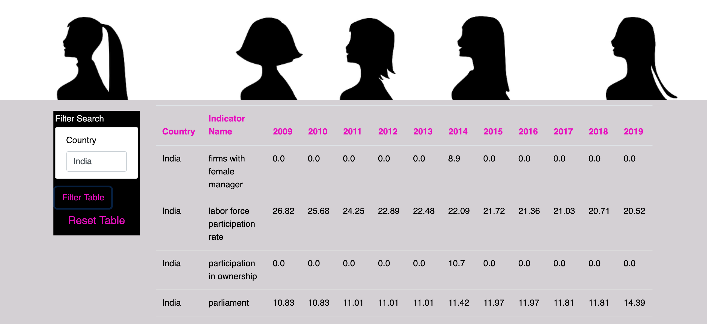
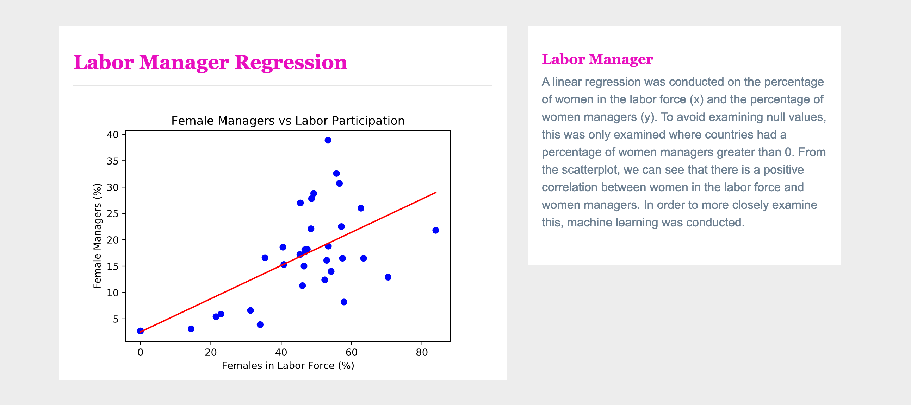
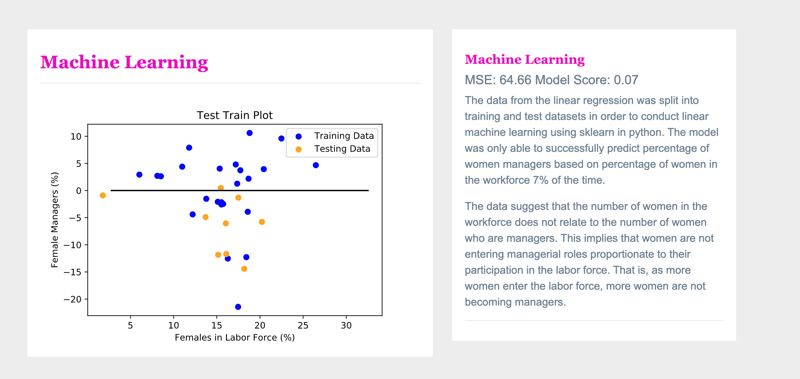
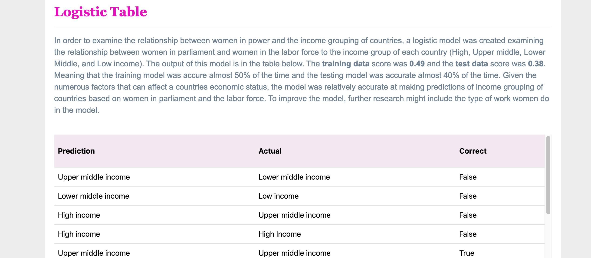
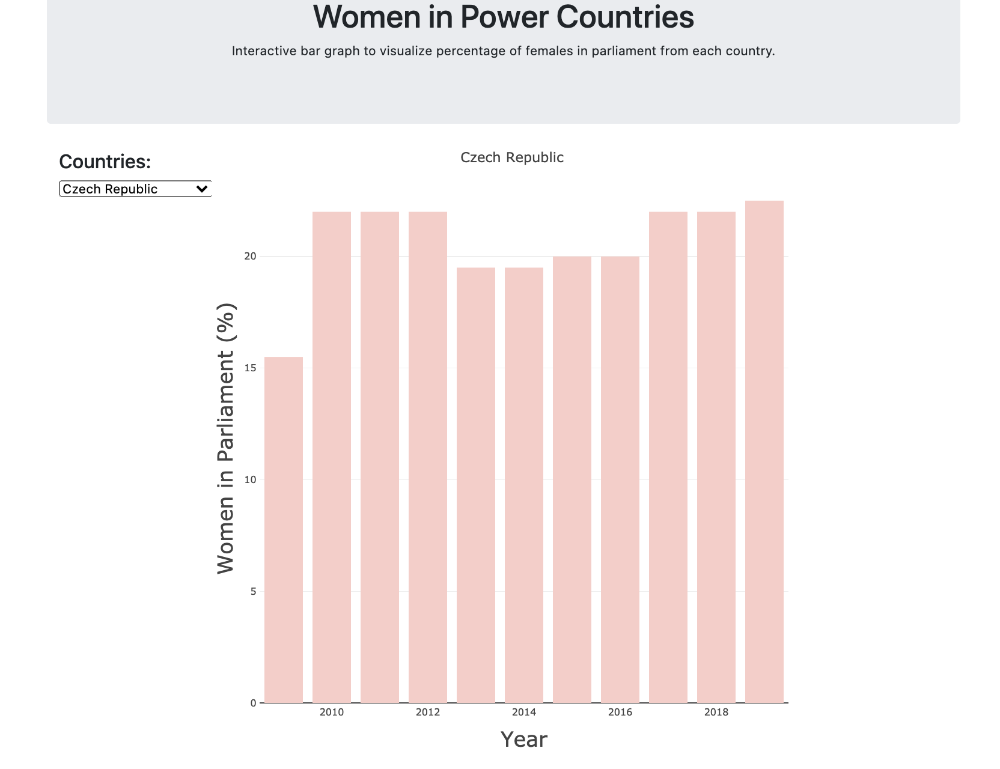
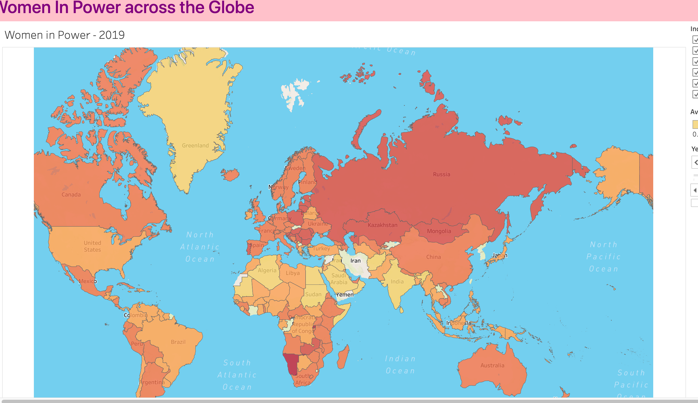
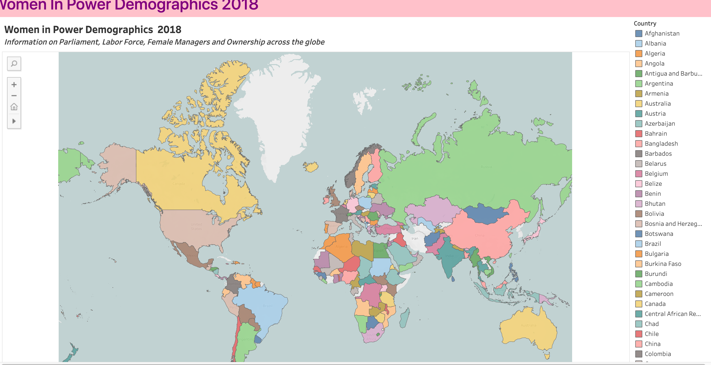

https://liliana-ilut.github.io/women-in-power/docs/index.html

### Women-in-Power

 Team Members:
    Corrine Ptacek,
    Lisa Weinstein,
    Katie Young,
    Manisha Shetti,
    Liliana Ilut
 
This project was created for the Northwestern Data Science Bootcamp as a final project.  As a team, we selected a database that reflected the percentages of women in power globally that had parliamentary forms of government.  We compared the dataset to another dartaset from the same source  that contained information on equality clauses within a specific country's constitution and other quotas that could affect the percentages reported of women in management,the labor force, woman owned businesses, and corporate board quotas.   

Here are the steps that we followed:

1.  The question we were curious about was did the amount of women in the workforce affect the amount of women in leadership position within a parliamentary government?

2. In order to learn about this we found data from Makeover Monday and a supplemental dataset from the world data bank with a series of questions that we culled to assist in our hypothesis that more women in the workforce lead to more women in leadership within parliamentary governments across the globe. We chose dataset spanning 10 years (2009-2019).Our supplemental data only had 1 year worth of questions (2018). 

3. We completed the ETL using Pandas within Jupyter Lab and PostgreSQL to merge our datasets. Our visualizations required two versions of our datasets. 

4. We created our machine learning model by using Scikit-Learn using linear regression, logistic regression table and a residual plot. 

5. We created visualization using JavaScript D3.js.  We also used HTML/CSS/Bootstrap.

6.  We used Tableau to perform the following visualizations:
    a.  a looping time-lapse illustrating the global growth of women in parliament and workforce over a period of ten years
    b.  a map containing global demographics regarding women in parliament, workforce, and company ownership along with other factors that could affect these numbers in 2018. 

Below is a snapshot of our insights:

Our initial  table is a filtered table based on country that filters across four datasets.

Our regression showed that more women in the workforce correllates to more women managers. 

Our machine learning illustrated that women in the workforce is a poor predictor of women in management. 

Our logistic regression was a moderate predicator of income level in relation to women in the workforce and women in parliament.

Our bar graph shows the percentage of women in parliament over ten years filtered by country.

Our time-lapse shows a global view of the growth of women in parliament and the workforce over a ten year span(2009-2019). 

Our other Tableau visualization shows a detailed map of each country's demographic of percentage women in the workforce, women in parliament, women owned firms, and women managers.  In addition to this, we also included which countries have equality clauses in their constitution and/or other laws accounting for women in leadership for the year 2018. 

